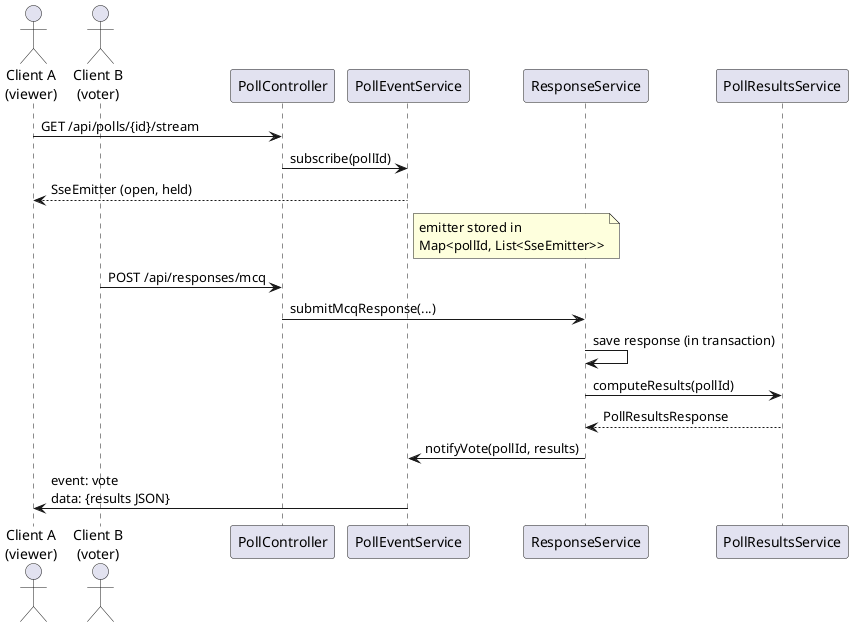

# Real-time updates via Server-Sent Events

How poll results get pushed to connected clients as votes come in.

## Why SSE

Poll results only ever flow server → client (no client → server data over the
stream itself; votes are submitted separately over plain HTTP POST). SSE gives
us that one-way push over plain HTTP, with browser-native reconnect, no extra
protocol/handshake, and no need for a WebSocket dependency. That fits this
use case better than WebSockets, which would be overkill for a channel that
never needs to send data back.

## Alternatives considered

**Short-polling** (`GET /results` every N seconds) — simplest to build, but
latency is bounded by the interval (laggy or wasteful), and a room of
clients all polling during a live moment (audience voting during a talk)
generates a lot of repeat requests that mostly return unchanged data. Every
poll is also a full HTTP request/response round trip, even when nothing
changed.

**Long-polling** (client `GET /results`, server holds the request open until
there's a new vote or a timeout, then the client immediately re-requests) —
better latency than short-polling since there's no fixed interval, but it
means holding a request (and a server thread, under a traditional servlet
model) open per waiting client, then tearing it down and immediately
opening a new one on every response — repeating the full HTTP
request/response overhead (headers, connection setup) each cycle. SSE gets
the same "push as soon as it happens" latency over a single
connection that just stays open, without the request-teardown-and-reopen
churn.

**Webhooks** (server calls a URL the client registers, when results change)
— doesn't fit here at all: webhooks need the *client* to be a server with
a publicly reachable endpoint to receive the callback, which a poll voter's
browser tab isn't. Webhooks are the right tool for server-to-server
notifications (e.g. notifying another backend system when a poll closes),
not for pushing live results to a browser.

**WebSockets** — full duplex, but this app never needs client → server data
over the stream itself; votes go through a normal `POST
/api/responses/...`, separate from the live channel entirely. Adopting
WebSockets here would mean:

- Paying for two-way capability that's never used — the connection would
  carry data in one direction only, just over a heavier protocol.
- Taking on connection/session lifecycle management ourselves: tracking
  open sockets, routing messages to the right one, handling the
  upgrade handshake, and reconnect/backoff on the client (WebSockets don't
  reconnect on their own — that logic has to be written and maintained).
- Extra infra friction: some proxies/load balancers need explicit config
  for the `Upgrade` handshake, and Spring's WebSocket support pulls in more
  machinery (session registries, message brokers) than this needs.

**SSE (chosen)** — matches the actual data flow exactly: server → client
only, over plain HTTP (`text/event-stream`), so it flows through normal
HTTP infra with no upgrade step. Reconnect is handled by the browser's
`EventSource` for free — no client-side retry/backoff logic to write.
Server-side, `SseEmitter` in Spring gives us subscribe/broadcast in a small
`PollEventService` (~35 lines, see below) with no socket bookkeeping beyond
"list of open emitters per poll" — we don't manage sockets, handshakes, or
message framing ourselves; the servlet container and `SseEmitter` do that.

The deciding factor was directionality: since results only ever flow one
way, SSE gets the "feels live" benefit of WebSockets without the protocol
overhead, the reconnect code, or the socket-management burden a two-way
channel would require — while still avoiding the latency/waste tradeoff of
polling.

## Components

- `PollController` — exposes `GET /api/polls/{id}/stream`
  (`Content-Type: text/event-stream`), returns an `SseEmitter` for the
  requesting client.
- `PollEventService` — in-memory registry of open emitters, keyed by poll id.
  Owns subscribe (add) and notify (broadcast) logic.
- `ResponseService` — after persisting a vote (MCQ / rating / word cloud),
  triggers a broadcast for that poll.
- `PollResultsService` — recomputes the full result set for a poll on demand
  (used both by the plain `GET /{id}/results` endpoint and by the SSE push).

## Flow

1. A client opens `GET /api/polls/{id}/stream`. `PollController.stream`
   returns an `SseEmitter` with no timeout (`Long.MAX_VALUE`) and
   `PollEventService.subscribe` registers it under that poll's id. The
   connection is held open — this is the only work done at subscribe time,
   no results are pushed immediately on connect.
2. A separate client submits a response (`ResponseService.submitXResponse`).
   The response is saved, then — still inside the same `@Transactional`
   method — `PollResultsService.computeResults(pollId)` recomputes the
   aggregate results from scratch (counts per option / per rating / per
   word) by querying the repositories directly.
3. `PollEventService.notifyVote(pollId, results)` iterates every emitter
   registered for that poll and sends a `vote` named event with the results
   JSON as the payload.

## State and lifecycle

- Subscriber state lives only in memory (`ConcurrentHashMap` of
  `CopyOnWriteArrayList<SseEmitter>>`), inside a single application instance.
  It is **not** persisted and **not** shared across instances — see
  Limitations below.
- Cleanup is wired via `SseEmitter` callbacks: `onCompletion`, `onTimeout`,
  and `onError` all remove the emitter from its poll's subscriber list, so a
  disconnected/dead client doesn't accumulate.
- A failed `emitter.send(...)` (e.g. the client dropped the connection
  without a clean completion) is treated as terminal: the emitter is
  completed and removed inline during the broadcast loop.

## Design choices worth calling out

- **Broadcast triggers a full recompute, not an incremental update.**
  Every vote re-runs the aggregate queries for that poll's type rather than
  maintaining running counters. Simple and always consistent with the DB,
  at the cost of a query per vote per poll (acceptable at low/medium
  concurrency; would need revisiting for high-volume polls).
- **Notify happens inside the write transaction**, not after commit. If the
  transaction rolls back after `notifyVote` has already fired, subscribers
  could have received results for a vote that never persisted. In practice
  the failure window is small (`notifyVote` is the last statement), but it's
  not transactionally safe.
- **No last-event-id / replay support.** SSE's built-in reconnect (`Last-Event-ID`)
  isn't used — a client that reconnects gets nothing until the next vote. The
  plain `GET /{id}/results` endpoint exists as the fallback for a client to
  fetch current state on (re)connect.

## Known limitations

- **Single-instance only.** Subscriber lists are process-local. Running
  multiple backend instances behind a load balancer would split
  subscribers across instances and votes handled by one instance would
  never reach clients connected to another. Fixing this needs a shared
  broker (Redis pub/sub, a message queue) fanning out to each instance's
  local emitters.
- **No auth/authorization check on the stream endpoint** — anyone who can
  reach `/api/polls/{id}/stream` can subscribe to that poll's results.
- **Unbounded emitter timeout** (`Long.MAX_VALUE`) means a client that never
  disconnects cleanly (no `onError`/network reset) can hold a slot
  indefinitely; there's no server-side idle/heartbeat timeout.
