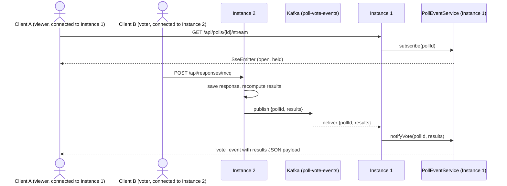

# Real-time updates via Server-Sent Events

We want to show real time poll results to users.
How poll results get pushed to connected clients as votes come in.

## Why SSE

Poll results only ever flow server → client (no client → server data over the
stream itself; votes are submitted separately over plain HTTP POST). SSE gives
us that one-way push over plain HTTP.

## Alternatives considered

**Short-polling** (`GET /results` every N seconds) 
-Pros
  Simplest

-Cons
  Latency is bounded by interval, makes a lot of request even when data is unchanged.


**Long-polling** (client `GET /results`, server holds the request open until
there's a new vote or a timeout, then the client immediately re-requests) —
-Pros
  Better latency than short polling since theres no fixed interval,
  
-Cons
 Opens a thread per client before tearing it down at the end. Need to repeatedly do it.

**Webhooks** (server calls a URL the client registers, when results change)
- Cons
  Need a publicly reachable endpoint, the users browser isnt, more suitable for server to server

**WebSockets** 

- Pros
  Can do full duplex communications

-Cons
  We do not need client to server, only need server to client, websocket is overkill
  Have to manage connection manangement ourselves, very complicated.


**SSE (chosen)** — matches the actual data flow exactly: server → client
only, over plain HTTP (`text/event-stream`), so it flows through normal
HTTP infra with no upgrade step. Reconnect is handled by the browser's
`EventSource` for free,  no client-side retry/backoff logic to write.
Server-side, `SseEmitter` in Spring gives us subscribe/broadcast in a small
`PollEventService` (~35 lines, see below) with no socket bookkeeping beyond
"list of open emitters per poll" — we don't manage sockets, handshakes, or
message framing ourselves; the servlet container and `SseEmitter` do that.

## Components

- `PollController` — exposes `GET /api/polls/{id}/stream`
  (`Content-Type: text/event-stream`), returns an `SseEmitter` for the
  requesting client.
- `PollEventService` — in-memory registry of open emitters on *this*
  instance, keyed by poll id. Owns subscribe (add) and local broadcast logic.
- `ResponseService` — after persisting a vote (MCQ / rating / word cloud),
  publishes a vote event for that poll to Kafka.
- `PollResultsService` — recomputes the full result set for a poll on demand
  (used both by the plain `GET /{id}/results` endpoint and by the SSE push).
- **Kafka** (`poll-vote-events` topic, keyed by `pollId`) — fans a vote event
  out to every backend instance, so each instance's `PollEventService` can
  push to the subscribers connected to it. Each instance runs its own
  consumer group (one group per instance) so every instance receives every
  event, rather than Kafka load-balancing partitions across instances.
  Managed instance (Aiven), bootstrap host:
  `kafka-bae772b-tangkenyi2001-3df3.c.aivencloud.com:21723` (SASL_SSL —
  username/password supplied via env vars, never committed; see
  `spring.kafka.bootstrap-servers` / `spring.kafka.properties.sasl.jaas.config`
  in `application.properties`). The SASL_SSL listener presents a cert signed
  by Aiven's project CA (not a public CA), so the client needs a local
  truststore built from that CA cert — neither the CA cert nor the
  truststore are committed (`backend/src/main/resources/kafka/` is
  gitignored, since it's environment-specific, not a secret). To set up
  locally:
  ```
  # 1. Download the CA cert from the Aiven console (Kafka service ->
  #    Overview -> Connection information -> CA Certificate) and save it to:
  #    backend/src/main/resources/kafka/aiven-kafka-ca.pem

  # 2. Build a truststore from it:
  mkdir -p backend/src/main/resources/kafka
  keytool -importcert -alias aiven-kafka-ca \
    -file backend/src/main/resources/kafka/aiven-kafka-ca.pem \
    -keystore backend/src/main/resources/kafka/kafka.truststore.p12 \
    -storetype PKCS12 -storepass aiven-kafka-ca -noprompt
  ```
  (`spring.kafka.ssl.trust-store-*` in `application.properties` expects the
  result at exactly that path/password.)

## Why Kafka for fan-out

Without a pub/sub layer, `PollEventService`'s subscriber list only lives in
one instance's memory. That's fine on a single instance, but it breaks the
moment there's more than one: a viewer connected to Instance A never sees a
vote that was submitted against Instance B, because Instance B has no way to
tell Instance A a vote happened — the two processes don't know about each
other. That's the specific problem a pub/sub layer solves: it lets any
instance publish "a vote happened on poll X" and have *every* instance
(not just the one that handled the vote) receive it, so each can push to its
own locally-connected clients.

Kafka was the pick over something like Redis pub/sub mainly because a
managed Kafka instance was already available — no new infra to stand up or
operate. The event itself doesn't need Kafka's durability/replay guarantees
(a poll-vote notification is stale the instant the next vote arrives, so
nobody needs to replay old ones), but reusing existing infra outweighed
bringing in a lighter tool just for this.

## Flow



1. A client opens `GET /api/polls/{id}/stream` against whichever instance it
   lands on. `PollEventService.subscribe` registers the `SseEmitter` in that
   instance's local, in-memory subscriber list for the poll — no results are
   pushed immediately on connect.
2. A client submits a response, possibly against a different instance.
   `ResponseService` saves the vote, recomputes results via
   `PollResultsService`, and publishes `{pollId, results}` to the
   `poll-vote-events` Kafka topic.
3. Every instance's Kafka consumer receives the event (each instance is its
   own consumer group) and calls its local `PollEventService.notifyVote`,
   which loops over that instance's subscribers for the poll and sends a
   `vote` SSE event with the results JSON.

## Known limitations (scaling)

- **Local fan-out per instance is still a synchronous loop.** Each
  instance's `notifyVote` sends to its subscribers for a poll one at a time,
  on the thread handling the Kafka consumer callback — a poll with a large
  audience on one instance, or a slow/stalled client, adds latency to that
  instance's delivery of every vote.
- **`CopyOnWriteArrayList` copies the full subscriber list on every
  join/leave**, so a burst of viewers connecting at once (e.g. right when a
  poll opens) is O(n²) total work per instance to onboard n local viewers.
- **No cap on subscribers per poll or per instance** — the real ceiling is
  Tomcat/OS connection and thread defaults, which aren't tuned for this.

